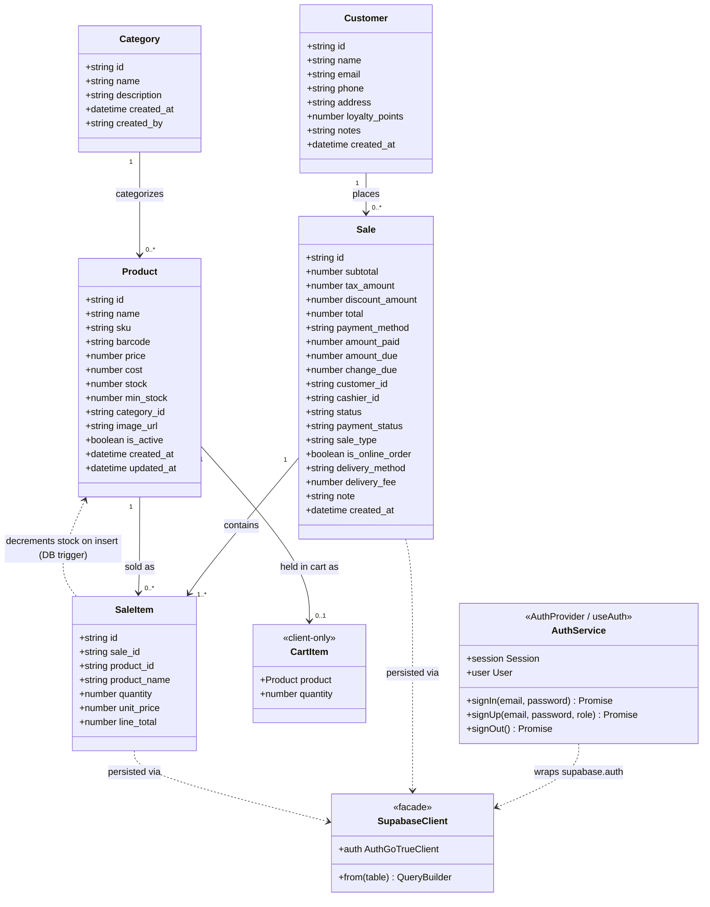
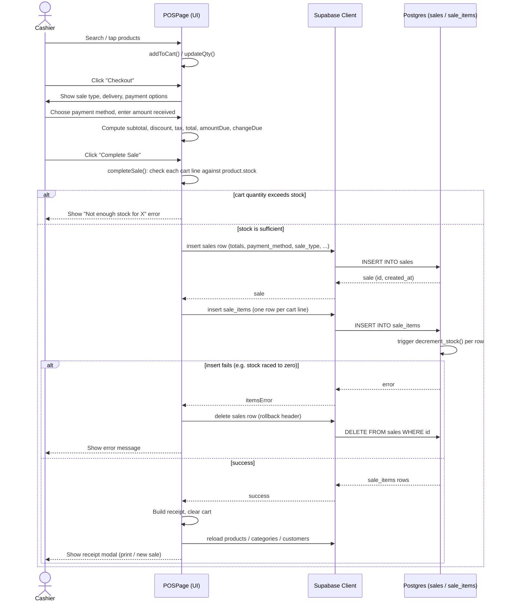
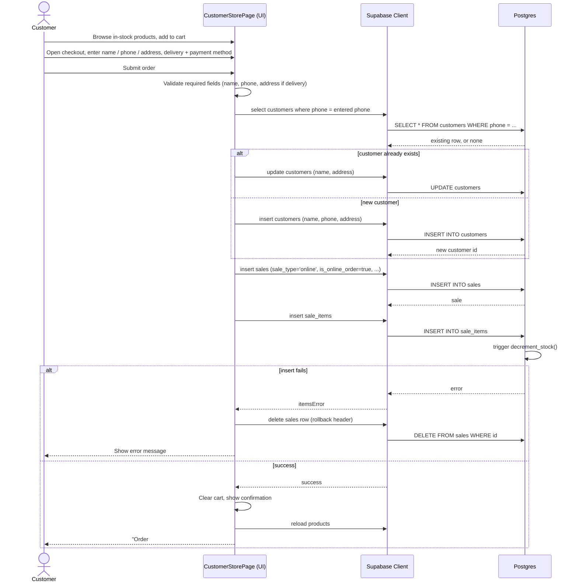
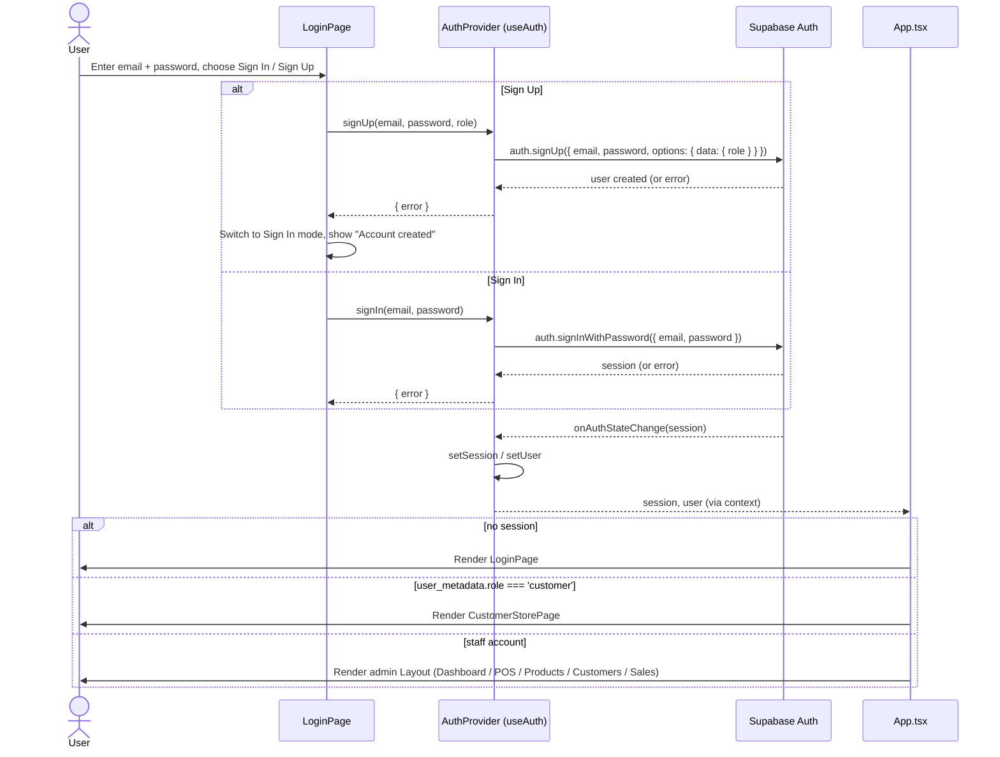

# ELECTRO-POS — UML Diagrams

These diagrams document the current architecture and core flows of ELECTRO-POS
as of commit `833b2cb` (2026-09-08). They are generated directly from the
Supabase schema (`supabase/migrations/`) and the client application
(`src/lib`, `src/pages`) — nothing here is speculative.

They render natively on GitHub (Mermaid support). To view or edit them
elsewhere, paste a block into the [Mermaid Live Editor](https://mermaid.live).

## Contents

1. [Class Diagram — Domain Model](#class-diagram--domain-model)
2. [Sequence Diagram — In-Store Checkout (POS)](#sequence-diagram--in-store-checkout-pos)
3. [Sequence Diagram — Online Self-Checkout (Customer Store)](#sequence-diagram--online-self-checkout-customer-store)
4. [Sequence Diagram — Authentication](#sequence-diagram--authentication)

---

## Class Diagram — Domain Model

Reflects the five Postgres tables (`categories`, `products`, `customers`,
`sales`, `sale_items`) and the client-side types in `src/lib/supabase.ts`,
plus the two service classes every page goes through: the Supabase client
facade and the auth service exposed by `AuthProvider`/`useAuth`.

**Notes**

- `created_by` (categories/products/customers) and `cashier_id` (sales)
  default to `auth.uid()` in Postgres — every row is attributed to the
  authenticated staff member who created it.
- `SaleItem → Product` is more than a foreign key: a Postgres trigger
  (`decrement_stock`) fires `AFTER INSERT ON sale_items` and atomically
  decrements `products.stock`, raising an exception if stock would go
  negative. A matching `restore_stock` trigger runs `AFTER DELETE` to undo it.
- `CartItem` only exists in the browser (`POSPage` / `CustomerStorePage`
  component state) — it's never persisted as its own table.

---

## Sequence Diagram — In-Store Checkout (POS)

The cashier-facing flow in `src/pages/POSPage.tsx` (`completeSale`).

---

## Sequence Diagram — Online Self-Checkout (Customer Store)

The shopper-facing flow in `src/pages/CustomerStorePage.tsx`, used when a
signed-up `customer`-role account (or the "Customer View" toggle) places an
order for pickup or delivery.

Note the difference from the POS flow: a walk-in cashier sale already knows
the customer (or leaves it as "Walk-in"), while an online order has to
find-or-create the `customers` row from the phone number first, since the
shopper isn't picked from an existing list.

---

## Sequence Diagram — Authentication

`src/lib/auth.tsx` (`AuthProvider`) wraps Supabase Auth and gates the whole
app in `App.tsx`: no `session` → `LoginPage`; `role === 'customer'` →
`CustomerStorePage`; otherwise the admin `Layout` with POS/Products/etc.

